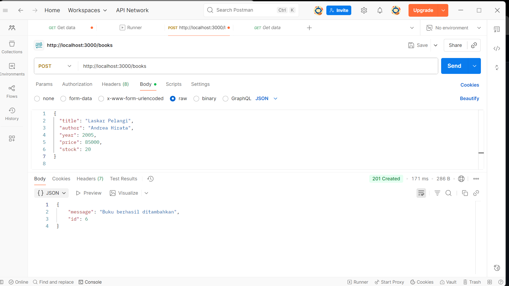

# Mini Project PWL25 Book Store API (CRUD)

## Deskripsi Proyek
Proyek ini adalah implementasi *Restful API* sederhana untuk manajemen data buku (Book Store API) menggunakan **Node.js** dan *framework* **Express.js**. Data disimpan dalam database **MySQL** dan operasi API meliputi fungsionalitas **CRUD (Create, Read, Update, Delete)**. Proyek ini juga dilengkapi dengan *middleware* untuk validasi data dan penanganan error.

## Struktur File Proyek


## Konfigurasi dan Instalasi

### 1. Database
Proyek ini menggunakan database MySQL. Bisa Menggunakan Aplikasi XAMPPL.
Buat database baru dengan nama `crud_books`.

**Skema Tabel `books` ):**

```sql
CREATE TABLE books (
    id INT AUTO_INCREMENT PRIMARY KEY,
    title VARCHAR(255) NOT NULL,
    author VARCHAR(255) NOT NULL,
    year INT,
    price INT,
    stock INT,
    created_at TIMESTAMP
);

```

## .env
DB_HOST=localhost
DB_USER=root
DB_PASS=
DB_NAME=crud_books
PORT=3000

# Penjelasan Detail Screenshot Pengujian API

Berikut adalah penjelasan detail dari setiap *screenshot* yang menunjukkan tahapan pengujian fungsionalitas CRUD API menggunakan Postman:

## 1. Operasi READ (GET)

| Screenshot | Deskripsi Detail |
| :---: | :--- |
|  | Menunjukkan hasil pengujian `GET http://localhost:3000/books` **sebelum** data apa pun ditambahkan. Status yang diterima adalah **200 OK**, dan *response body* adalah array JSON kosong (`[]`), menandakan koneksi berhasil namun database masih kosong. |
|  | Menunjukkan hasil pengujian `GET http://localhost:3000/books` **setelah** dua buku berhasil ditambahkan. Status yang diterima adalah **200 OK**, dan *response body* menampilkan dua objek buku lengkap dengan data buku yang telah dibuat. |
|  | Menunjukkan pengujian `GET http://localhost:3000/books/5`. Permintaan ini berhasil mengambil data buku spesifik dengan **ID 5** ("Pulang"). Status yang diterima adalah **200 OK**, dan *response body* hanya berisi objek buku tersebut. |

## 2. Operasi CREATE (POST)

| Screenshot | Deskripsi Detail |
| :---: | :--- |
|  | Menunjukkan konfigurasi awal permintaan **POST** ke `http://localhost:3000/books`. Metode disetel ke **POST**, dan tipe *body* disetel ke **raw** dengan format **JSON**. *Body* awalnya kosong. |
|  | Menunjukkan permintaan **POST** untuk menambahkan buku pertama dengan data: `{"title": "Pulang", "author": "Leila S. Chudori", "year": 2012, "price": 90000, "stock": 10}`. |
|  | Menunjukkan **respon** dari penambahan buku pertama. Status yang diterima adalah **201 Created**, dan *response body* mengonfirmasi penambahan buku dengan pesan `"Buku berhasil ditambahkan"` dan memberikan *ID* yang baru dibuat: `"id": 5`. |
|  | Menunjukkan permintaan **POST** untuk menambahkan buku kedua ("Laskar Pelangi"). Status yang diterima adalah **201 Created**, dan *response body* menunjukkan *ID* buku yang baru: `"id": 6`. |

## 3. Operasi UPDATE (PUT)

| Screenshot | Deskripsi Detail |
| :---: | :--- |
|  | Menunjukkan permintaan **PUT** ke `http://localhost:3000/books/5` untuk memperbarui buku dengan ID 5. Data `title` diperbarui menjadi `"Pulang (Edisi Cover Baru)"`. Status yang diterima adalah **200 OK**, dan *response body* menunjukkan pesan sukses: `"Buku berhasil diperbarui"`. |
|  | Menunjukkan verifikasi dari operasi PUT dengan menjalankan kembali `GET http://localhost:3000/books/5`. Status **200 OK** dan *response body* kini menampilkan data buku yang telah diperbarui, dengan `title` menjadi `"Pulang (Edisi Cover Baru)"`. |

## 4. Operasi DELETE

| Screenshot | Deskripsi Detail |
| :---: | :--- |
|  | Menunjukkan permintaan **DELETE** ke `http://localhost:3000/books/5` untuk menghapus buku dengan ID 5. Status yang diterima adalah **200 OK**, dan *response body* menunjukkan pesan sukses: `"Buku berhasil dihapus"`. |
|  | Menunjukkan verifikasi dari operasi DELETE dengan menjalankan kembali `GET http://localhost:3000/books/5`. Kali ini, server merespons dengan status **404 Not Found** dan pesan `"Buku tidak ditemukan"`, yang mengonfirmasi bahwa buku dengan ID 5 telah berhasil dihapus dari database. |
